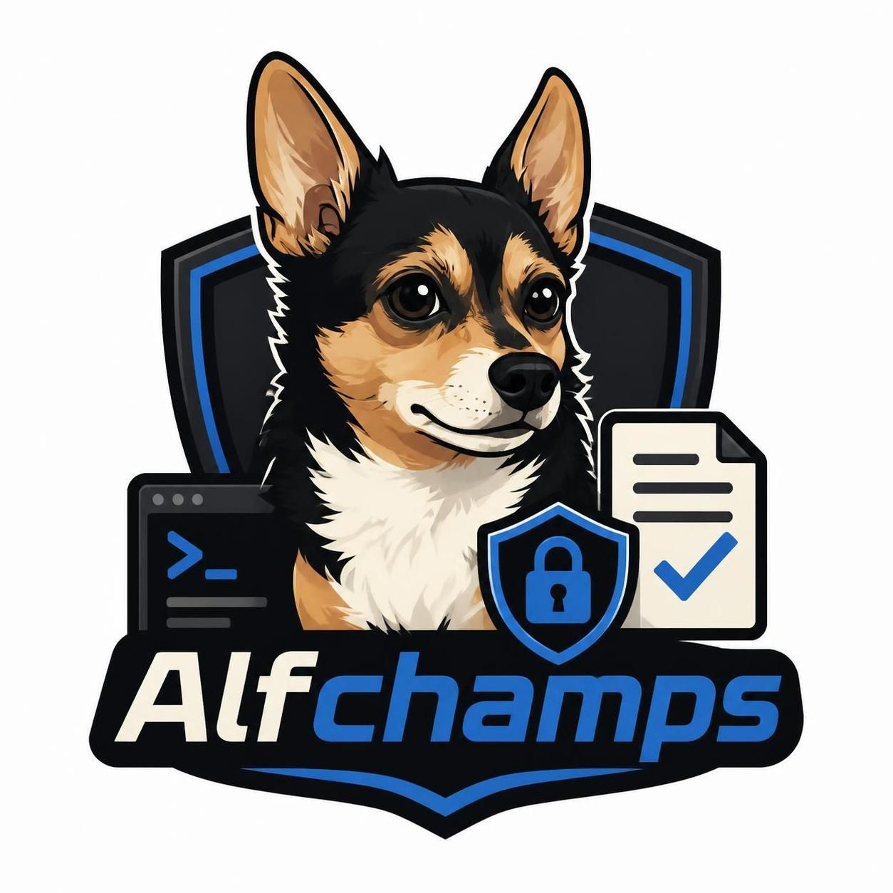

# Alfchamps

Security reporting tool for penetration testers and security engineers, built in
loving memory of **Alfred** — our champion.

Alfchamps helps you run structured security checks against OWASP standards,
capture findings (notes, reproduction steps, screenshots), and generate branded
PDF reports.

> ⚠️ **Local-only application.** Alfchamps is designed to run on **localhost**
> (127.0.0.1) on your own machine. It has **no authentication** and is **not**
> meant to be exposed to a network. Please run it locally only — see
> [Security](#security).

## Features

- **OWASP-based checklists** per category:
  - Web Application — **OWASP Top 10 (2021)**, **ASVS 4.0.3** (with L1/L2/L3 level filtering), **WSTG** (all 12 categories)
  - API — **OWASP API Security Top 10 (2023)**
  - Mobile — **MASVS**
  - GenAI / LLM — **OWASP GenAI LLM Top 10 (2026)**
- **Test wizard**: name a test, pick standards, and (for ASVS) choose a verification level.
- **Workspace**: grouped checklist with per-item status, notes, reproduction steps, and screenshot uploads. Add your own custom checks as **sub-points** nested under the item you're testing (with their own repro steps and screenshots).
- **Branded PDF reports**: choose an accent color, add a company name/logo, and download a themed PDF with a custom executive summary, per-item detail (sub-points included), the **Alfchamps logo** on the cover, and Alfred's tribute.

## Tech stack

- Backend: **Python / FastAPI**, SQLAlchemy + SQLite, ReportLab (PDF)
- Frontend: **React + Vite**
- Deployment: local `venv`/`npm` **and** containers (`podman`/`docker`)

## Quick start (local)

Requires Python 3.10+ and Node 18+.

```bash
# One-time setup (venv + backend deps + frontend deps)
bash setup.sh        # or: make setup

# Run the backend on http://127.0.0.1:8000
make run-backend

# In another terminal, run the frontend on http://127.0.0.1:5173
make run-frontend
```

Then open **http://localhost:5173**.

> The first backend launch seeds the OWASP checklist data (idempotent).

### Makefile targets

```
make setup           Create venv, install backend + frontend deps
make run-backend     Run FastAPI on 127.0.0.1:8000
make run-frontend    Run Vite on 127.0.0.1:5173
make build           Build the frontend for production
make test-backend    Run the backend pytest suite
make lint            Run ruff on the backend
make lint-frontend   Run ESLint on the frontend
make podman-up       Build & start containerized app
make podman-down     Stop containers
make docker-up       Build & start containerized app (docker compose)
make docker-down     Stop containers (docker compose)
```

## Containerized (Podman / Docker)

```bash
# Podman
podman-compose up -d --build      # or: make podman-up

# Docker
docker compose up -d --build      # or: make docker-up
```

Then open **http://localhost:8080**.

- The backend is **not** published to the host (internal network only).
- The frontend is bound to `127.0.0.1:8080` (localhost).
- Data (SQLite DB, uploads, reports) persists in the `alfchamps_data` volume.

## Project structure

```
backend/
  app/
    main.py            FastAPI app, CORS, security headers
    config.py          settings from environment
    models.py          SQLAlchemy models
    schemas.py         Pydantic schemas
    memorial.py        hardcoded Alfred tribute (PR-only)
    routers/           projects, checklists, assets, reports (PDF), standards
    seed/              idempotent OWASP seeders (incl. official ASVS + WSTG)
  tests/
frontend/
  src/
    pages/             Dashboard, NewTest (wizard), Workspace, ReportSettings
    components/
    api/client.js      API client
assets/                Alfred photo / logo placeholders
Containerfile.backend  Backend image (multi-stage, non-root)
Containerfile.frontend Frontend image (Vite build + nginx, non-root)
container-compose.yaml Orchestration
setup.sh, Makefile     Local dev & commands
```

## Configuration

Configuration is read from environment variables / `.env` (see `.env.example`):

| Variable | Description | Default |
| --- | --- | --- |
| `DATABASE_URL` | SQLAlchemy database URL | `sqlite:///./data/alfchamps.db` |
| `ALFCHAMPS_DATA_DIR` | Data directory (DB, uploads, reports) | `./data` |
| `CORS_ORIGINS` | Comma-separated allowed origins | `http://localhost:5173,http://127.0.0.1:5173` |
| `UPLOAD_MAX_SIZE_MB` | Max upload size in MB | `10` |
| `ALLOWED_UPLOAD_EXTENSIONS` | Allowed image types | `png,jpg,jpeg,webp,gif` |

## Security

Alfchamps is built to be **run locally only**:

- No authentication is implemented by design. **Do not expose it to a network.**
- Services bind to **127.0.0.1** (localhost).
- Strict **CORS** (localhost origins) and **security headers** (CSP, `X-Content-Type-Options`, `X-Frame-Options`, etc.).
- **Pydantic** validation on all requests.
- Uploaded files are validated (type/size) and stored under random names in `data/uploads`.
- Containers run as a **non-root** user with health checks and resource isolation.

If you need to use Alfchamps in a shared or multi-user environment, add
authentication and a proper deployment review before doing so.

## Tribute / memorial

This tool is built in loving memory of Alfred, our champion — and the best dog a human could ask for.
Best friend, always by my side. Forever missed, never forgotten.
